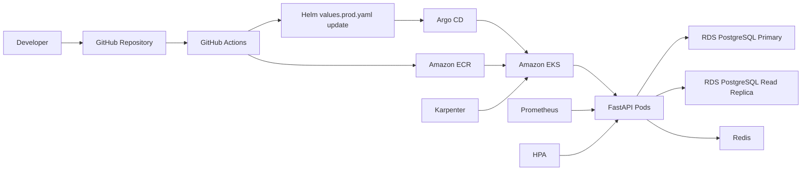

# URL Shortener EKS Platform

FastAPI 애플리케이션을 AWS EKS에 배포하기 위한 인프라, CI/CD, GitOps, 모니터링 구성을 한 저장소에 정리한 프로젝트입니다.

면접 제출용으로는 "단순 API 구현"보다 다음 역량을 보여주는 데 초점을 둡니다.

- Terraform으로 AWS 네트워크, EKS, ECR, RDS, IAM/OIDC 리소스 구성
- Docker 이미지 빌드 후 ECR에 배포하는 GitHub Actions CI/CD 파이프라인
- Helm Chart와 Argo CD를 이용한 GitOps 기반 Kubernetes 배포
- RDS Primary/Read Replica 분리, Redis Cache-Aside, Prometheus 메트릭 수집
- HPA와 Karpenter를 통한 Pod/Node 확장 구조

> 현재 애플리케이션 API는 URL 단축 비즈니스 로직보다 인프라 검증에 초점을 둔 `/healthz`, `/items`, `/metrics` 엔드포인트 중심으로 구성되어 있습니다.

## 아키텍처



## 기술 스택

| 영역 | 기술 |
| --- | --- |
| Backend | Python 3.11, FastAPI, SQLAlchemy, Pydantic Settings |
| Database | PostgreSQL, RDS Primary, RDS Read Replica |
| Cache | Redis, Cache-Aside pattern |
| Container | Docker, Docker Compose |
| Kubernetes | EKS, Deployment, Service, Ingress, HPA, Secret, ServiceMonitor |
| IaC | Terraform, terraform-aws-modules |
| CI/CD | GitHub Actions, AWS OIDC, ECR |
| GitOps | Helm, Argo CD |
| Observability | Prometheus, kube-prometheus-stack, PrometheusRule |
| Scaling | Kubernetes HPA, Karpenter |

## 저장소 구조

```text
.
├── terraform/                    # AWS VPC, EKS, ECR, RDS, IAM/OIDC, Karpenter 인프라
├── cluster-addons/               # 클러스터 공통 애드온 Argo CD Application
│   ├── alb-controller/
│   ├── cert-manager/
│   ├── ingress-nginx/
│   ├── karpenter/
│   ├── metric-server/
│   └── prometheus/
├── url-shortener/
│   ├── app/                      # FastAPI 애플리케이션
│   ├── k8s/                      # Kubernetes 매니페스트와 Argo CD Application
│   ├── url-shortener-chart/      # 애플리케이션 배포용 Helm Chart
│   ├── Dockerfile
│   ├── docker-compose.yml
│   └── README.md                 # 로컬 개발 가이드
└── .github/workflows/            # CI/CD workflow
```

## 핵심 구현 포인트

### 1. 장기 AWS Access Key 없는 CI/CD

GitHub Actions는 AWS OIDC로 IAM Role을 assume하도록 구성했습니다. 따라서 CI/CD 파이프라인에 장기 AWS Access Key를 저장하지 않습니다.

파이프라인 흐름:

1. `ruff`로 lint 검사
2. EKS 노드 아키텍처에 맞춰 `linux/amd64` Docker 이미지 빌드
3. Git SHA 기반 immutable 이미지 태그를 ECR에 push
4. `url-shortener/url-shortener-chart/values.prod.yaml`의 이미지 태그 갱신
5. 변경된 Helm values 파일을 Git에 다시 commit
6. Argo CD가 Git 상태를 기준으로 EKS에 동기화

### 2. GitOps 배포

애플리케이션은 Helm Chart로 패키징하고 Argo CD가 배포합니다.

- 원하는 배포 상태는 Git에 저장합니다.
- Argo CD는 Helm values를 적용해 EKS에 배포합니다.
- `prune`, `selfHeal`을 활성화해 클러스터 상태가 Git과 달라졌을 때 자동으로 복구합니다.

### 3. 데이터베이스 읽기/쓰기 분리

FastAPI 애플리케이션은 SQLAlchemy Engine을 쓰기용과 읽기용으로 분리합니다.

- `DATABASE_URL`: 쓰기 경로이며 RDS Primary 연결을 기대합니다.
- `DATABASE_READ_URL`: 읽기 경로이며 RDS Read Replica 연결을 기대합니다.
- 로컬 개발에서는 `DATABASE_READ_URL`이 비어 있으면 `DATABASE_URL`로 fallback합니다.

`/items/_db` 엔드포인트로 write/read 세션이 기대한 DB 노드에 연결되는지 확인할 수 있습니다.

### 4. 장애 허용 Cache-Aside

읽기 API에는 Redis Cache-Aside 패턴을 적용했습니다.

- `GET /items`: 목록 캐시, 짧은 TTL
- `GET /items/{item_id}`: 단건 캐시, 상대적으로 긴 TTL
- `POST`, `DELETE`: 관련 캐시 키 무효화
- Redis가 일시적으로 장애 상태여도 애플리케이션은 DB 직접 조회로 계속 응답합니다.

### 5. 관측성과 알림

애플리케이션은 `/metrics`에서 Prometheus 메트릭을 노출합니다.

수집 메트릭:

- HTTP method, path, status code 기준 요청 수
- Redis cache hit/miss 수
- DB query latency histogram

Helm Chart에는 Prometheus Operator 연동을 위한 `ServiceMonitor`, `PrometheusRule` 리소스가 포함되어 있습니다.

알림 규칙 예시:

- 높은 5xx 에러율
- 낮은 캐시 히트율
- 높은 DB query P99 latency
- Prometheus Watchdog

## 로컬 실행

자세한 로컬 실행 가이드는 [url-shortener/README.md](url-shortener/README.md)를 참고합니다.

빠른 실행:

```bash
cd url-shortener
cp .env.example .env
docker compose up -d --build
```

헬스체크:

```bash
curl http://localhost:8001/healthz
```

데이터 생성:

```bash
curl -X POST http://localhost:8001/items \
  -H "Content-Type: application/json" \
  -d '{"name":"test","description":"DB write test"}'
```

데이터 조회:

```bash
curl http://localhost:8001/items
```

메트릭 확인:

```bash
curl http://localhost:8001/metrics
```

## 인프라 배포

> 실제 AWS 리소스를 생성하므로 비용이 발생할 수 있습니다. `terraform apply` 전에 변수와 생성 리소스를 반드시 확인하세요.

```bash
cd terraform
terraform init
terraform plan -var="db_password=<change-me>"
terraform apply -var="db_password=<change-me>"
```

EKS 생성 후 kubeconfig 설정:

```bash
aws eks update-kubeconfig \
  --region ap-northeast-2 \
  --name urlshortener
```

클러스터 공통 애드온은 `cluster-addons/` 아래의 Argo CD Application으로 관리합니다.

예시:

```bash
kubectl apply -f cluster-addons/ingress-nginx/application.yaml
kubectl apply -f cluster-addons/cert-manager/application.yaml
kubectl apply -f cluster-addons/prometheus/application.yaml
kubectl apply -f cluster-addons/karpenter/application.yaml
```

애플리케이션 배포:

```bash
kubectl apply -f url-shortener/k8s/argocd/application.yaml
```

## Kubernetes 배포 구성

Helm Chart는 개발/운영 환경 값을 분리합니다.

- `values.yaml`: 기본 Chart 값
- `values.dev.yaml`: 개발 환경 override
- `values.prod.yaml`: 운영 환경 override
- `values.*-secret.yaml`: 로컬/비공개 secret 값, 실제 credential을 넣은 상태로 commit하지 않습니다.

운영 환경 기준 설정:

- API replica 2개 이상
- HPA 활성화
- Redis 활성화
- TLS Ingress 활성화
- Prometheus ServiceMonitor 활성화
- RDS Primary/Replica URL을 Kubernetes Secret으로 주입

## API 엔드포인트

| Method | Path | 설명 |
| --- | --- | --- |
| `GET` | `/healthz` | 애플리케이션 헬스체크 |
| `GET` | `/metrics` | Prometheus 메트릭 |
| `POST` | `/items` | write DB 세션을 통한 데이터 생성 |
| `GET` | `/items` | read DB 세션과 Redis 캐시를 통한 목록 조회 |
| `GET` | `/items/{item_id}` | read DB 세션과 Redis 캐시를 통한 단건 조회 |
| `DELETE` | `/items/{item_id}` | 데이터 삭제 및 관련 캐시 무효화 |
| `GET` | `/items/_db` | write/read DB 연결 대상 확인 |

## 구현 시 중점

| 주제 | 구현 | 의도 |
| --- | --- | --- |
| 배포 재현성 | Terraform, Helm, Argo CD | 인프라와 애플리케이션 상태를 코드로 관리 |
| 인증 정보 관리 | GitHub OIDC, Kubernetes Secret values | 장기 AWS Key와 직접적인 비밀값 노출 최소화 |
| 런타임 안정성 | health check, HPA, Redis fallback | 캐시 장애 시에도 API 응답 유지 |
| 읽기 확장성 | RDS Read Replica, read/write engine 분리 | 읽기 트래픽을 쓰기 경로와 분리 |
| 관측성 | Prometheus metrics, alert rules | 로그만이 아니라 지표 기반으로 장애 징후 확인 |
| 비용 고려 | 작은 인스턴스, Multi-AZ 비활성화 | 비용을 통제하면서 운영 패턴을 실습 |

## 트레이드오프와 개선 예정

- 인프라 검증 API 중심 구조를 실제 URL 단축/리다이렉트 API로 확장
- 애플리케이션 시작 시 테이블 생성 대신 Alembic 마이그레이션 적용
- GitHub Actions에 단위/통합 테스트 자동화 추가
- ECR push 전 Trivy 같은 이미지 취약점 스캔 추가
- 운영 비밀값을 AWS Secrets Manager 또는 External Secrets Operator로 관리
- 샘플 IP allow/deny 규칙을 환경별 Ingress 정책으로 교체
- 운영급 가용성을 위해 RDS Multi-AZ와 deletion protection 활성화
- 배포 전략, 롤백 절차, 배포 후 smoke test 문서화
- 동적 path label 정규화로 Prometheus metric cardinality 축소

## 제출 전 체크리스트

면접 제출 전에 다음 항목을 확인합니다.

- 루트 `README.md`가 GitHub 저장소 첫 화면에 표시되는지 확인
- 실제 AWS Account ID, 비밀번호, 토큰, private endpoint가 노출되지 않았는지 확인
- 배포 환경을 보여줄 수 있다면 스크린샷 또는 아키텍처 다이어그램 추가
- 최신 GitHub Actions 실행 결과가 성공인지 확인
- Argo CD Application이 `Healthy`, `Synced` 상태인지 확인
- `/healthz`, `/items`, `/items/_db`, `/metrics`를 실제로 테스트할 수 있는지 확인
- 시연 후 불필요한 AWS 리소스를 정리했는지 확인

## 라이선스

개인 학습 및 면접 제출용 프로젝트입니다. 오픈소스로 공개할 경우 별도의 `LICENSE` 파일을 추가하세요.
